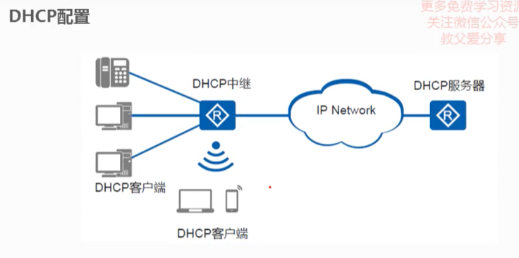
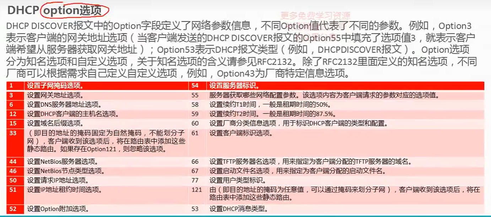
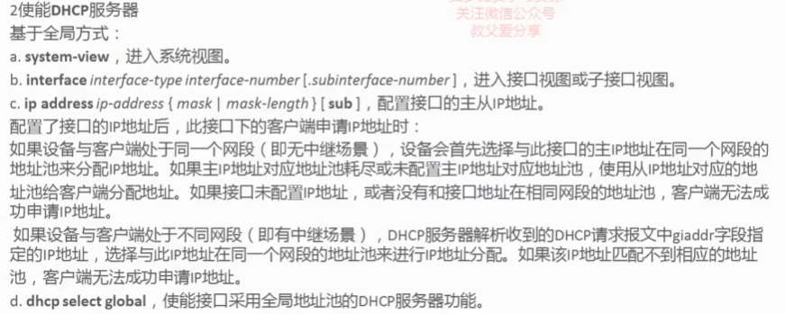
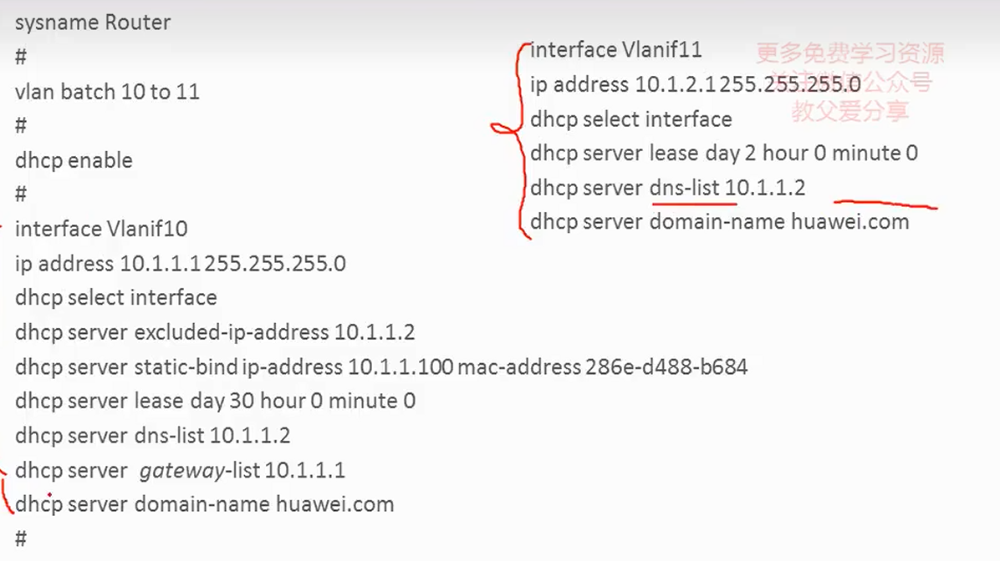

## 1. 路由协议与AD


### AD ( Administrative Distance)

在华为路由器中，AD 是指 Administrative Distance（行政距离）的缩写。

Administrative Distance 是用于路由协议之间选择最优路径的度量值，表示路由器对路由信息来源的信任程度或优先级。

AD 值越低，表示路由信息来源的优先级越高。

### 五种不同的路由协议：

* DIRECT（直连路由）
* OSPF（Open Shortest Path First）
* IS-IS（Intermediate System to Intermediate System）
* RIP（Routing Information Protocol）
* STATIC (静态路由 包括 默认路由)

| **特征/属性**      | **直连路由**       | **静态路由**           | **OSPF**             | **IS-IS**                | **RIP**            |
| ------------------ | ------------------ | ---------------------- | -------------------- | ------------------------ | ------------------ |
| **类型**           | 直连               | 静态                   | 链路状态             | 链路状态                 | 距离矢量           |
| **学习方式**       | 无需学习           | 手动配置               | 动态学习             | 动态学习                 | 动态学习           |
| **算法**           | 无需计算           | 无需计算               | SPF（Dijkstra 算法） | SPF（Dijkstra 算法）     | 距离矢量           |
| **适用范围**       | 小型网络、直连     | 小型网络、出口路由     | 中大型网络           | 中大型网络               | 小型网络           |
| **AD 值**          | 0                  | 60                     | 10（IPv4）           | 15（IPv4）               | 100（IPv4）        |
| **协议独立性**     | 与协议无关         | 与协议无关             | 仅支持 IP            | 仅支持 IP                | 仅支持 IP          |
| **灵活性**         | 低（静态定义）     | 高（手动配置）         | 高（动态学习）       | 高（动态学习）           | 中（适应小型网络） |
| **网络拓扑适应性** | 仅适用于直连网络   | 需要手动配置           | 适用于复杂拓扑结构   | 适用于复杂拓扑结构       | 适用于简单网络     |
| **适用场景**       | 直连网络、简单网络 | 出口路由、特定流量控制 | 复杂网络、企业级网络 | 复杂网络、大型运营商网络 | 小型网络           |

### 1. **DIRECT（直连路由）:**

- **定义：** 直连路由是指路由器直接连接到目标网络，无需通过其他设备进行路由。
- **特点：**
  - 直连路由是最基本的一种路由形式，不需要经过动态路由协议的学习。
  - 直连路由的 AD 值为 0，表示非常可靠。
  - 示例：当两个设备直接连接在同一个子网上，它们就是直连的。

### 2. **OSPF（Open Shortest Path First）:**

- **定义：** OSPF 是一种链路状态路由协议，用于在 IP 网络中选择最短路径。
- **特点：**
  - OSPF 使用 Dijkstra 算法计算最短路径，支持分层区域结构。
  - OSPF 的 AD 值为 10，表示非常可靠，优先级较高。
  - OSPF 通过链路状态数据库（Link State Database）来构建网络拓扑图。
  - OSPF 支持 VLSM（Variable Length Subnet Masking）和路由汇总。

### 3. **IS-IS（Intermediate System to Intermediate System）:**

- **定义：** IS-IS 是一种链路状态路由协议，通常用于中型和大型网络。
- **特点：**
  - IS-IS 使用 SPF（Shortest Path First）算法计算最短路径，支持分层区域结构。
  - IS-IS 的 AD 值为 15，表示比 OSPF 略低，但同样较可靠。
  - IS-IS 在 OSI 协议栈中定义，但也被广泛用于 IP 网络。
  - IS-IS 支持 IPv4 和 IPv6。

### 4. **RIP（Routing Information Protocol）:**

- **定义：** RIP 是一种距离矢量路由协议，最初用于小型网络。
- **特点：**
  - RIP 使用跳数作为路径选择的度量值，支持最多 15 跳。
  - RIP 的 AD 值为 100，表示可靠性较低，优先级相对较低。
  - RIP 的更新间隔较短，可能导致网络中的收敛时间较长。
  - RIP v2 支持 VLSM 和路由掩码，相比 RIP v1 具有改进。

### **5. STATIC（静态路由）:**

#### 1. **定义：**

静态路由是由网络管理员手动配置的路由信息，不依赖于动态路由协议。管理员手动指定了目标网络的下一跳路由器或出口接口。静态路由是一种简单而直观的路由方式，适用于小型网络或需要精确控制路由的场景。

#### 2. **特点：**

- **手动配置：** 静态路由需要管理员手动输入路由信息，包括目标网络、下一跳地址（或出口接口）和相关参数。
- **可控性：** 由于手动配置，管理员可以精确控制路由，选择特定的路径，实现路由的精确管理。
- **适用场景：** 静态路由通常用于小型网络或特殊需求的场景，例如连接到外部网络的出口路由、特定流量的路由策略等。

#### 3. **配置示例：**

以下是一个简单的静态路由配置示例，假设要添加一条静态路由，将流量发送到目标网络 `192.168.1.0/24`，下一跳地址是 `10.0.0.1`：

```bash
<设备> system-view
[设备] ip route-static 192.168.1.0 255.255.255.0 10.0.0.1
```

**默认路由**

```bash
<设备> system-view
[设备] ip route-static 0.0.0.0 0.0.0.0 10.0.0.1
```

## 2. ip地址配置


## 3. DHCP






DHCP（Dynamic Host Configuration Protocol）是一种网络协议，

采用广播通信.

用于在TCP/IP网络上自动分配IP地址和其他网络配置信息给设备，如计算机、打印机、路由器等。

DHCP的主要目标是简化网络管理，减少手动配置的工作量，以及避免IP地址冲突。

以下是DHCP的一些关键概念和工作原理：

### 1. **工作原理：**

- **租约（Lease）：** DHCP服务器租给设备的IP地址是有限期的，这个时间段称为租约。设备在租约过期前需要向DHCP服务器更新租约，否则IP地址可能会被分配给其他设备。
- **发现和提供：** 当设备加入网络时，它会广播一个DHCP发现请求。DHCP服务器收到请求后，向设备提供IP地址的租约信息。
- **请求和确认：** 设备收到服务器提供的信息后，发送DHCP请求。服务器回复DHCP确认，确认设备可以使用提供的IP地址。

### 2. **DHCP服务器和客户端：**

- **DHCP服务器：** 提供IP地址和其他网络配置信息的计算机或设备。可以是网络中的一台专用服务器或路由器上的服务。
- **DHCP客户端：** 寻求分配IP地址和其他配置信息的设备。通常是计算机、打印机或其他连接到网络的设备。

### 3. **分配的配置信息：**

   DHCP服务器可以分配以下配置信息给客户端：

- IP地址
- 子网掩码
- 默认网关
- DNS服务器
- WINS服务器
- 租约时间

### 4. **DHCP消息类型：**

- **Discover（发现）：** 客户端广播寻找DHCP服务器。
- **Offer（提供）：** DHCP服务器回复发现请求，提供IP地址。
- **Request（请求）：** 客户端请求使用DHCP提供的IP地址。
- **Acknowledge（确认）：** DHCP服务器确认客户端的请求，正式提供IP地址。

### 5. **DHCP Relay：**

   当DHCP服务器不在设备所在的子网上时，需要使用DHCP Relay代理。DHCP Relay会在设备的广播上添加一个DHCP Relay Agent Information Option，并将广播转发到DHCP服务器。

### 6. **安全性考虑：**

   由于DHCP是基于广播的，因此存在一些安全性问题，例如IP地址欺骗（IP address spoofing）。

DHCP Snooping等技术可以用来缓解这些问题。

### 7. **IPv4和IPv6：**

   DHCP最初设计用于IPv4，但同样也有适用于IPv6的版本，称为DHCPv6。

### 8. **DHCP和静态IP地址的比较：**

- DHCP是动态的，IP地址由服务器自动分配。
- 静态IP地址是手动配置的，每个设备都需要管理员手动指定IP地址。

总体而言，DHCP是一种非常方便的机制，使得网络中的设备能够自动获取IP地址和其他配置信息，减轻了网络管理员的工作负担，特别是在大型网络中。

## 4. 华为路由器DHCP配置




### 配置为客户端分配ip地址



