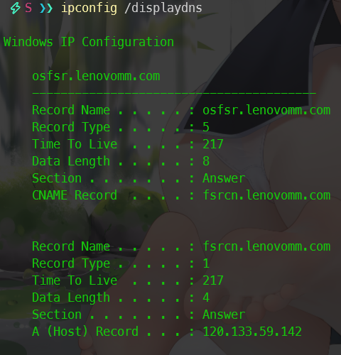

## arp命令

显示和修改地址解析协议 (ARP) 缓存中的条目。

ARP 缓存包含一个或多个表，用于存储 IP 地址及其解析的以太网或令牌环物理地址。

 针对计算机上安装的每个以太网或令牌环网络适配器，都有一个单独的表。 如果使用 arp 命令时不带参数，则将显示帮助信息。

**以下是关于ARP命令的知识的总结，包括命令语法和参数：**

| 命令                  | 描述                                                                 |
| --------------------- | -------------------------------------------------------------------- |
| arp                   | 显示和修改ARP缓存中的条目。                                          |
| arp /a [`<inetaddr>`] | 显示所有接口的当前ARP缓存表。/n参数区分大小写。                      |
| arp /g [`<inetaddr>`] | 与/a相同。                                                           |
| arp /d `<inetaddr>`   | 删除具有特定IP地址的ARP缓存条目，其中inetaddr是IP地址。              |
| arp /s `<inetaddr>`   | 向ARP缓存添加一个静态条目，将IP地址inetaddr解析为物理地址etheraddr。 |
| arp /?                | 在命令提示符下显示帮助。                                             |

**说明:**

- ARP缓存存储了IP地址和它们的物理地址（通常是以太网或令牌环地址）的映射。
- 每个计算机上安装的每个以太网或令牌环网络适配器都有自己的ARP表。
- 使用"arp"命令时，如果不带参数，则将显示帮助信息。
- 使用"arp /a"或"arp /g"命令可以显示当前所有接口的ARP缓存表。
- 使用"arp /a `<inetaddr>`"或"arp /g `<inetaddr>`"可以显示特定IP地址的ARP缓存条目。
- 使用"arp /d `<inetaddr>`"可以删除特定IP地址的ARP缓存条目。
- 使用"arp /s `<inetaddr>` `<etheraddr>`"可以添加静态ARP缓存条目，将IP地址解析为物理地址。
- 使用"arp /?"可以在命令提示符下显示帮助信息。

## ipconfig命令与DNS和DHCP

在Windows中

* `ipconfig /flushdns`命令来清除本地DNS缓存
* `ipconfig /displaydns`显示客户端DNS缓存的内容
* `ipconfig /registerdns`刷新所有DHCP租约，并重新注册DNS名字
* `ipconfig /release`释放网卡的DHCP配置参数和当前使用的IP地址

