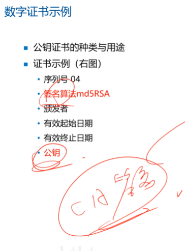
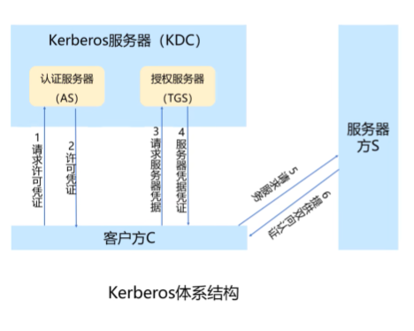
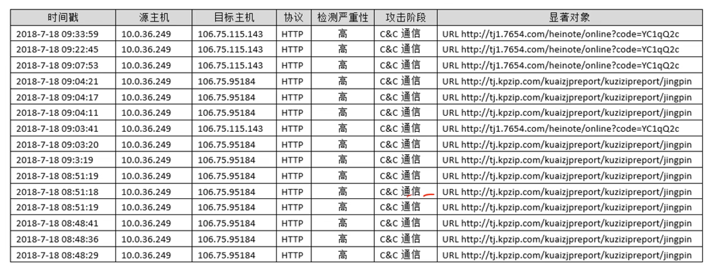
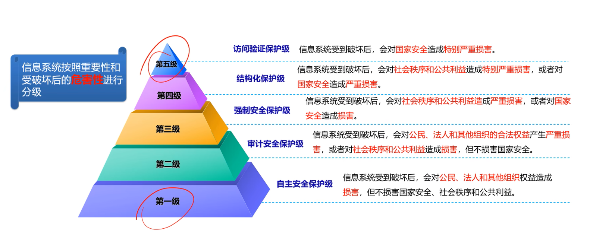
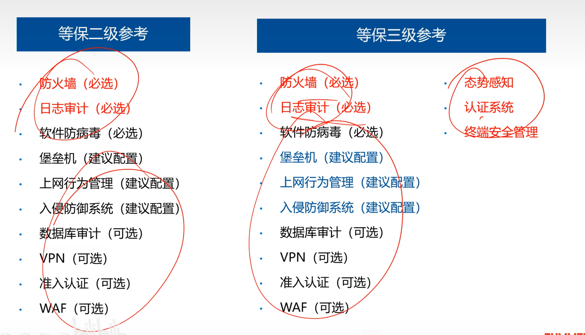

# 网络攻击

## 主动攻击

## 被动攻击

# 加密算法

## 对称加密算法

## 非对称加密算法

## 哈希加密算法

# 数字签名与数字证书

## 数字签名与验证过程

## 数字证书

### 数字证书示例

# PKI体系结构

## Kerberos体系

# 常见攻击与防范

## SQL注入攻击

### 防范

## XSS跨站脚本攻击

### 防范

## ARP高级持续性威胁

高级持续性威胁（Advanced Persistent Threat，APT），又叫高级长期威胁，是一种复杂的、持续的网络攻击，包含三个要素：高级、长期、威胁。高级是指执行APT攻击需要比传统攻击更高的定制程度和复杂程度，需要花费大量时间和资源来研究确定系统内部的漏洞；长期是为了达到特定目的，过程中“放长线”，持续监控目标，对目标保有长期的访问权；威胁强调的是人为参与策划的攻击，攻击目标是高价值的组织，攻击一旦得手，往往会给攻击目标造成巨大的经济损失或政治影响，乃至于毁灭性打击。

## 木马

## 一句话木马

## 攻击特征码

## 常见病毒类型

# 计算机等级保护标准

