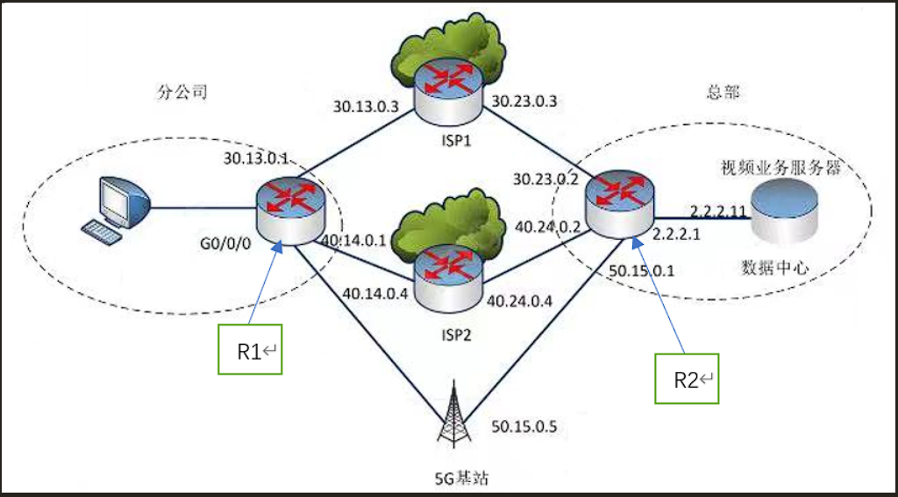

## broadcast-suppression

**broadcast-suppression**命令用来配置接口下允许通过的最大广播报文流量。

**undo broadcast-suppression**命令用来恢复接口下允许通过的最大广播报文流量为缺省值。

缺省情况下，接口下允许通过的最大广播报文流量按照百分比抑制，比例值为10%。

### 例题

(2)网络试运行一段时间后，在二层网络中发现了大量的广播报文，影响网络的性能。网络管理员在接入层交换机做了如下配置问题得以解决∶
[SW] interface gigabitethernet 0/0/3
[SW-GigabitEthernet0/0/3]broadcast-suppression 80
[SW-GigabitEthernet0/0/3]guit
请简述以上配置的功能。

## VRRP

**虚拟路由冗余协议（Virtual Router Redundancy Protocol）**

设备1和设备2之间运行VRRP协议，其中linke是VRRP心跳线，用于传输VRRP协议报文，若linke链路出现故障会导致设别2（backup状态）无法收到Master发送过来的VRRP报文，就认为Master设备出现了故障，从而进行设备角色的切换。

### 与双机热备不一样

虚拟路由冗余协议（VRRP）和双机热备份都是用于提高网络可靠性的重要技术，但它们在实际应用中有一些关键的区别。

首先，VRRP是一种容错协议，它保证了当链路中的路由器出现故障时，备份路由器能够自动替代故障路由器进行工作，从而确保网络通信的连续性和可靠性。在一个VRRP组中，所有的主备路由器都有相同的虚拟路由器标识（VRID），并且由一个Master路由器承担流量转发的工作，其他的路由器则作为Backup路由器处于待命状态。

另一方面，双机热备份是一种更常见的备份策略，主要用于防止由于主机或服务器故障引起的业务中断。在双机热备方案中，通常有两台机器同时运行相同的应用程序，当一台机器出现故障时，另一台机器能迅速接管它的工作，因此这种方案确保了业务的连续性。

## MTBF

MTBF，全称Mean Time Between Failures，是一个关键的可靠性指标，专门用于衡量产品，尤其是电器产品的可靠性。

* 这个指标以**小时**为单位

反映了产品保持正常工作的能力，也是体现产品质量的重要参数。当产品的寿命服从指数分布时，其故障率的倒数就叫做平均故障间隔时间，也就是MTBF。简单来说，MTBF越大，说明产品故障少，可靠性高。

另一方面，为了提高网络的可靠性，一种常用的方法是采用关键链路冗余技术。

这包括了

* 接口备份
* 接口监控组
* VRRP
* 双机热备份

等策略。在双机备份中，当网络链路故障发生时，系统会监控网络接口状态来触发主备链路切换，以确保网络流量不会超载，从而保障业务连通性。

而虚拟路由冗余协议（VRRP）则是一种路由协议，主要用于解决局域网中静态网关单点失效问题，可以确保数据流量的平稳切换和网络连通性，尤其在边缘网络中被广泛使用。

为了实现更高的可靠性和可用性，核心交换机通常会应用一些冗余技术，包括冗余电源、冗余风扇和冗余模块等。

例如，当一个电源模块故障时，其他模块可以自动接管，确保交换机的稳定运行。通过这些冗余技术，我们可以显著降低网络中断的风险。

同时，堆叠技术也被广泛应用于核心交换机中，通过将多个交换机物理连接成一个逻辑单元，以增强系统的处理能力和管理便利性。

## IPSEC VPN

要保证数据安全的前提下，则需要使用VPN技术来保障通过公共的因特网访问总部网络自的数据传输安全。

由于分支机构要使用客户端方式访问，所以一般使用SSL VPN方式，客户端安装SSL VPN客户端软件进行登录验证从而建立VPN；

防火墙和总部之间一般使用IPSEC VPN，和总部建立IPSEC隧道，同时也要允许10.11.229.0网段访问互联网。

## DDOS

DDos即分布式拒绝服务攻击: 指借助于客户/服务器技术，将多个计算机联合起来作为攻击平台，对一个或多个目标发动DDoS攻击,从而成倍地提高拒绝服务攻击的威力。

由于其隐蔽性和分布性很难被识别和防御，DDoS攻击技术发展十分迅速。这种攻击规模大、危害性强。包括ACKflood, SYN Flood, ICMP flood, UDP flood等。

## DHCP Snooping

用户获得的地址非规划分配的地址IP地址，可判断网络中有其他非法DHCP服务器，而最常见的原因是用户私接路由器，并将路由器的LAN口接入公司网络线路，导致路由器自带的DHCP向公司内网分配P地址。

在接入交换机上启用DHCP Snooping功能，将接入交换机的上行接口设置为DHCP trust接口属性，其他接口设置为untrunst接口（只有trust接口才会接收DHCP响应报文）。

## ARP detection

ARP detection功能主要应用于接入设备上，对于合法用户的ARP报文进行正常转发，否则直接丢弃，从而防止仿冒用户，仿冒网关的攻击。

交换机上开启ARP detection功能后会对于ARP非信任端口要进行用户合法性检查，以防止仿冒用户的攻击。

用户合法性检查是根据ARP报文中源IP地址和源MAC地址检查用户是否是所属VLAN所在端口上的合法用户，包括基于IP Source Guard静态绑定表现的检查，基于DHCP Snooping安全表现的检查等。

## Port-security

Port-security enable 命令用来使能端口安全功能，Port-security max-mac-num命令用来配置端口安全MAC地址学习限制数。

## 策略路由

图为某公司的总部和分公司网络拓扑，分公司和总部数据中心通过ISP1的网络和ISP2的网络互连。

并且连接5G出口作为应急链路，分公司和总部数据中心交互的业务有语音、视频、FTP和HTTP四种。

要求通过配置策略路由实现分公司访问业务分流。配置网络质量分析(NQA)与静态路由联动实现链路冗余。

其中,语音和视频以ISP1为主链路、ISP2为备份； FTP和HTTP以ISP2为主链路,ISP1为备份。

### ACL

通过在R1上配置策略路由，以实现分公司访问总部的流量可根据业务类型分组到L1和L2两条链路并形成主备关系，首先完成ACL相关配置。
配置R1的ACL来定义流
首先定义视频业务流ACL 2000
[R1] acl 2000
[R1-acl-basic-2000] rule1 permit destination (1) 0.0.255.255
[R1-acl-basic-2000] quit
定义Web.业务流ACL 3000
[R1] acl 3000
[R1-acl-adv-3000]rule 1 permit tcp destination any destination-port （2）0.0.255.255
[R1-acl-basic-3000]0 quit

(1) 2.2.0.0

(2) eq 80 //操作符号不要忘记写

gt/lt/neq/range (还有这些操作符)

### 流分类, 流行为, 流策略

完成R1策略路由剩余相关配置。
1、创建流分类，匹配相关ACL定义的流
[R1] traffic classifer video
[R1-cassfervideo] if-match acl 2000
[R1-classifier-video] quit
[R1] traffic classifer web
[R1-classifer-web] if-match acl 3000
[Rl-classifer-web] quit
2、创建流行为并配置重定向
[R1] traffic behavior b1
[R1-behavor-b1] rediret ip-nexthop（3）
[R1-behavior-b1] quit
[R1] traffic behavior b2
[R1-behavior-b2] redirect ip-nexthop（4）
[R1-behavior-b2] quit
3、创建流策略,并在接口上应用。
[R1] traffic policy p1
[R1-trafficpolicy-p1) classiffer video behavior b1
[R1-trafficpolicy-p1) classiffer web behavior （5）
[R1-trafficpolicy-p1] quit
[R1] interface GigabitEthernet0/0/0
[R1-GigabitEthernet]traffic-policy 1 (6)
[R1-GigabitEthernet]quit

(3) 30.13.0.3     //重定向到ISP1

(4) 40.14.0.4    // 重定向到ISP2

(5) b2   //traffic policy p1为web流分类

(6) inbound   //GigabitEthernet0/0/0为流的入口方向

### NQA链路探测

在总部网络,通过配置静态路由与NQA联动,实现R2对主链路的ICMP监控,如果发现主链路断开，自动切换到备份链路。
在R2上完成如下配置：
1、开启NQA,配置ICMP类型的NQA测试例，检测R2到ISP1和ISP2网关的链路连通状态ISP1链路探测:
[R2] nqa test-instance admin isp1 //配置名为admin isp1的NQA测试例
……其他配置省略
ISP2链路探测:
[R2] nqa test-instance admin isp2
[R2-nqa-admin-isp2] test-type icmp
[R2-nqa-admin-isp2] destination-address ipv4 (7) //配置NQA测试目的地址
[R2-nqa-admin-isp2] frequency 10 //配置NQA两次测试之间间隔10秒
[R2-nqa-admin-isp2] probe-count 2 //配置NQA测试探针数目为2
[R2-nga-admin-isp2] start now
2、配置静态路由
[R2]ip route-static 30.0.0.0 255.0.0.0（8）track nqa admin isp1
[R2]ip route-static 40.0.0.0 255.0.0.0 40.24.0.4 track naa admin isp2
[R2]ip route-static 0.0.0.0 0.0.0.0 40.24.0.4 preference 100 track nga admin isp2
[R2]ip route-static 0.0.0.0 0.0.0.0 (9) preference 110 track nqa admin isp1
[R2]ip route-static 0.0.0.0 0.0.0.0（10）preference 120

(7) 40.14.0.1   // ISP2的最终目的, 与R1相连, 如果是40.24.0.4则无法判断ISP2到R1的链接是否出现问题

(8) 30.23.0.3  //下一跳

(9)30.23.0.3  //下一跳

(10) 50.15.0.5  //5G链路，作为应急链路 (优先级比ISP1, ISP2低)
